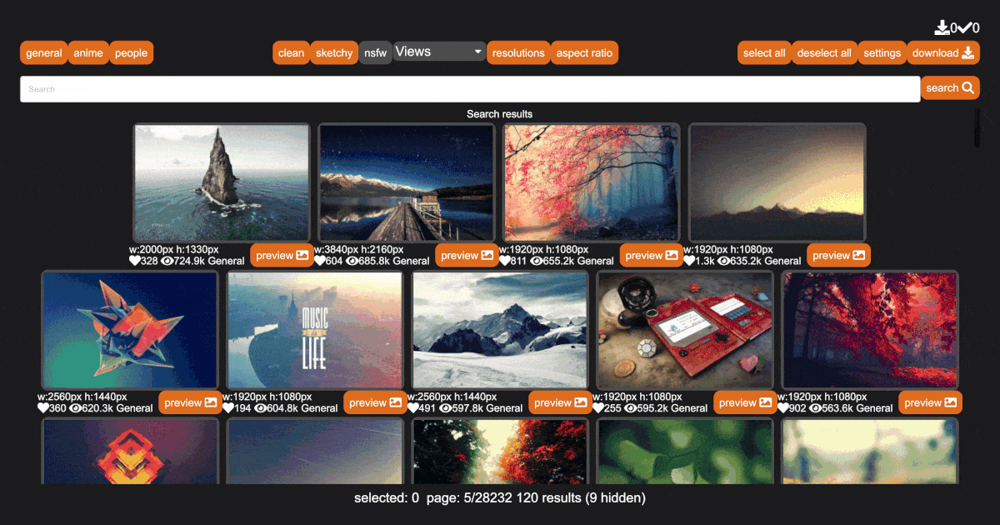

# Wall-a-bunga
Wall-a-bunga is a wallpaper downloader for [wallhaven.cc](http://wallhaven.cc) written in Rust using Iced

### Why?
I wanted to be able to download a bunch of images from Wallhaven at once with one click. I found a C++ program, but it was 
clunky and didn't make me happy. So, I had the classic thought, aha, rewrite this in Rust. So here we are...

### Features
* Search for wallpapers, select several, and bulk download them
* Sort by purity, clean/sketchy/nsfw (wallhaven.cc api token required for nsfw)
* Set a storage directory for wallpapers
* Filter wallpapers you already have downloaded from the results

### Installation
* On Windows ensure you have [Visual C++ runtime](https://aka.ms/vs/16/release/vc_redist.x64.exe) installed
* Download the executable [here](https://github.com/akarras/wall-a-bunga/releases/latest) and run it
* `cargo install --git https://github.com/akarras/wall-a-bunga`
* alternatively, `git clone https://github.com/akarras/wall-a-bunga`, and `git build --release` inside the root directory

### Contributing
* [Issues](https://github.com/akarras/wall-a-bunga/issues/new) with bugs and ideas are always welcome
* Feel free to make a PR, and correct my bad code, but at least explain why it's bad when you do it

### Contributors
* [me](https://github.com/akarras). I just wanted to make a dope README.
 No idea if anyone will actually use this app. :)